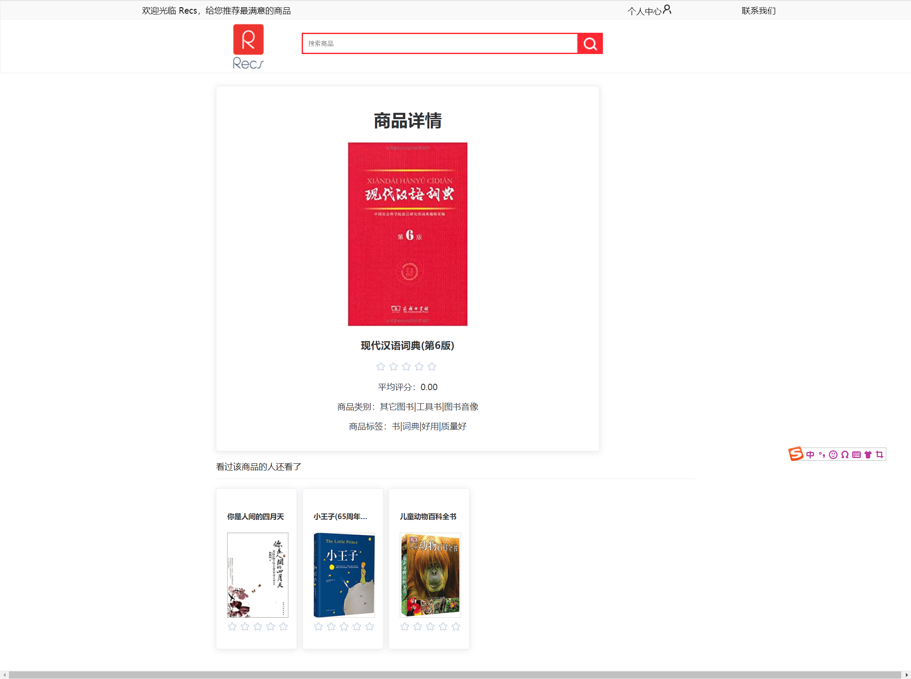
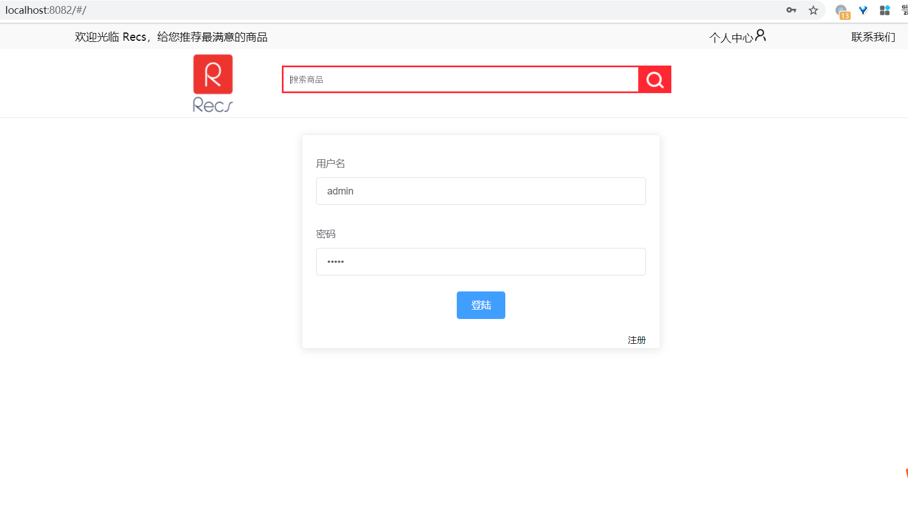

# FlinkCommodityRecommendationSystem
**Recs**  (基于 Flink 的商品推荐系统) 

## 1. 前言
系统取名为 `Recs`，灵感源于 `Recommendation System`。logo 使用在线 logo 网站制作。
作者开发该项目，是为了学习 `Flink ` 以及相关大数据中间件。出于展示目的，使用 Springboot + Vue 开发了配套的 web。
作者有过 python + django + JavaScript 的 web 开发的经历，考虑到项目使用 java 开发，为了技术栈的统一，现学了 Springboot 框架以及 Vue。
本项目借鉴了 [ECommerceRecommendSystem](https://github.com/ittqqzz/ECommerceRecommendSystem) 开源学习项目，前端部分借鉴较多，在作者搭建好的框架基础上进行优化。修改了 ui 以及部分 bug，并且新增部分功能。
经过本项目的开发锻炼，作者对大数据相关的技术有了较为系统的理解，收获较大。在开发过程中，遇到过很多问题，但都逐一攻克了。作者的经验是，解决问题最好的办法就是阅读官方文档和积极使用 Google。
最后，相关的技术都是现学现用，知识比较片面，因此本项目存在很多待优化的地方，欢迎大家 issue，一起学习，一起进步。

## 2. 项目简介
### 2.1 Recs 系统架构

系统主要工作流程：

- 用户登录/注册系统。
- 用户对商品进行评分。
- 评分数据通过 Kafka 发送到推荐模块的实时推荐任务中。
- 系统执行实时推荐任务，并且将数据存储到 hbase 的 rating 和 userProduct 表中。实时任务包括：实时 topN 以及 基于用户行为推荐。
- 实时 topN 将计算结果存储到 hbase 的 onlineHot 表中，基于用户行为推荐将计算结果存储到 hbase 的表 onlineRecommend 中。

- web 端通过查询 hbase 获取相关模块所需数据并展示结果。

### 2.2 首页

共有四个模块：

- 猜你喜欢：基于用户行为推荐，当用户对商品进行评分时，Flink  根据用户历史评分商品，结合 itemCF 计算记过。
- 热门商品：历史热门商品
- 好评商品：评分较高的商品
- 实时热门商品： 使用 Flink 时间滑动窗口，对过去一个小时热门商品进行统计，每 5 分钟滑动一次。

### 2.3 商品详情

- 展示商品详细信息

- 看过该商品的人还看了：基于 itemCF 进行推荐

### 2.4 登录

## 3. 模块说明

#### 3.1 推荐模块 (recommendation)

##### 3.1.1 猜你喜欢

实时推荐：

- 从 redist 中查询用户最近评分商品列表 ， redis key 为 `“ONLINE_PREFIX_” + userId`
- 从 hbase 表 `userProduct` 中查询用户历史评分商品列表。
- 根据用户刚评分的 `productId` 从 hbase 表 `itemCFRecommend` 表中查询相关的商品列表
- 对相关商品列表根据之前查出的最近评分商品列表和历史评分商品列表过滤
- 根据最近评分商品与本次商品的相似度以及用户历史评分对推荐商品重新排序。

##### 3.1.2 热门商品

对所有时间用户评分的商品根据评分次数进行逆序排序，选出热门商品。

- flink 将  hbase  `rating` 表加载到内存中，根据 productId group，并且统计出现次数
- 根据出现次数逆序排序。

##### 3.1.3 好评商品

## 5. 